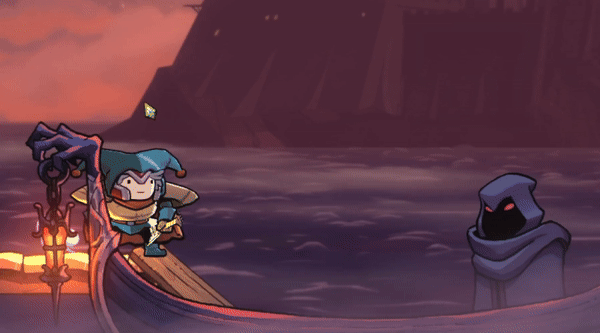

# АНАЛИЗ ДАННЫХ И ИСКУССТВЕННЫЙ ИНТЕЛЛЕКТ [in GameDev]
Отчет по лабораторной работе #2 выполнил(а):
- Леонтьев Алексей Максимович
- РИ230913

- Отметка о выполнении заданий (заполняется студентом):

| Задание | Выполнение | Баллы |
| ------ | ------ | ------ |
| Задание 1 | * | 60 |
| Задание 2 | * | 20 |
| Задание 3 | * | 20 |

Работу проверили:

[](https://nodesource.com/products/nsolid)

[](https://travis-ci.org/joemccann/dillinger)

Структура отчета


## Цель работы
Ознакомится с программами Anaconda с Jupiter Notebook и Unity.

## Задание 1
### Выберите одну из игровых переменных в игре, опишите её роль в игре, условия изменения / появления и диапазон допустимых значений. Постройте схему экономической модели в игре и укажите место выбранного ресурса в ней.
Для работы я выбрал игру [Rogue Legacy 2](https://store.steampowered.com/app/1253920/Rogue_Legacy_2/) – игра в жанре платформера с элементами Roguelite. Игрок играет за “наследников” – рандомно генерируемых персонажей с определёнными класса и чертами, влияющие на геймплей. Игроку предстоит пройти в Замок, постоянно меняющую свою структуру строения, и побеждать находящихся внутри врагов. Для прогресса игроку нужно добывать ресурс с заходов в Замок путём его исследования – __золото__.


- Золото практически является основным ресурсом для всех улучшений игрока, открытий новых классов, брони, рун и т.д. Для улучшений игроку нужно тратить золото в “Хабе”, где находится собственный замок игрока.
- Как и сказано выше, золото можно получить только путём исследования Замка, то есть за счёт победы над врагами и нахождения сундуков внутри него.


- То есть сам Замок является “_краном_” ресурсов. Причем не только золота, но и других ресурсов, но это не важно сейчас.

- Золото складывается в простейший “_инвентарь_” в виде счётчика. Туда золото попадает, оттуда и уходит.


- Хаб после заходов в Замок, можно сказать, является одним большим центром “_преобразователей_”. Тут находится и замок игрока, где происходит прокачка статов будущих наследников, открытие новых персонажей, даже открытие других “преобразователей” в лице Кузнеца, Рунописца и др. На всё это необходимо __золото__.
- Остальные “преобразователи” за очень редкими исключениями также используют золото (и какой-то другой ресурс, например, металл для Кузнеца) для “_преобразования_” в нужные игроку вещи (статы, улучшение некоторых аспектов и механик игры).


- Если по каким-то причинам игрок не потратил золото на момент отправки на следующий забег, которое у него сейчас находится в наличии, то против этого выступает Харон, который заберёт всё оставшееся золото у игрока, предотвращая накопление золота между забегами и подталкивая игрока и лучше играть для получения большего кол-ва золота, и прокачки персонажа. Он является “_трубой_” системы.



- Роль золота является ключевым элементом в прогрессе игрока по игре, поэтому она появляется везде в системе.


## Задание 2
### Написать программу Hello World на C# с запуском на Unity. 

- Скачать и установить программу Unity вместе с Visual Studio Code.
- Открываем Unity, создаём любой проект. После создания проекта открыть её, в файловом структуре проекта создаём скрипт HelloWorld на языке C#. Был выбран способ вывода текста "Hello World" через Консоль проекта при старте программы. В самом скрипте прописываем:

```py

public class HelloWorld : MonoBehaviour
{
    void Start()
    {
        Debug.Log("Hello World");
    }
}

```
- После создания скрипта HellowWorld создать новый объет и прикрепить к ней данный скрипт. После старта программы, в Консоль выведится Hello World

## Задание 3
### Оформить отчет в виде документации на github (markdown-разметка).

- Создать новый репозиторий, создать новый файл и скопировать в неё код с [репозитории](https://github.com/Den1sovDm1triy/DA-in-GameDev-lab1/blob/main/README.md).
- Изменить для необходимые нужды данного отчёта.


## Выводы

Я ознакомился с работой Jupiter Notebook, Unity и GitHub, что в дальнейшем поможет в учёбе на курсе "Анализ данных в разработке игр".

## Powered by

**BigDigital Team: Denisov | Fadeev | Panov**
