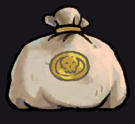

# АНАЛИЗ ДАННЫХ И ИСКУССТВЕННЫЙ ИНТЕЛЛЕКТ [in GameDev]
Отчет по лабораторной работе #2 выполнил(а):
- Леонтьев Алексей Максимович
- РИ230913

- Отметка о выполнении заданий (заполняется студентом):

| Задание | Выполнение | Баллы |
| ------ | ------ | ------ |
| Задание 1 | * | 60 |
| Задание 2 | * | 20 |
| Задание 3 | * | 20 |

Работу проверили:

[](https://nodesource.com/products/nsolid)

[](https://travis-ci.org/joemccann/dillinger)

Структура отчета


## Цель работы
Ознакомится с программами Anaconda с Jupiter Notebook и Unity.

## Задание 1
### Выберите одну из игровых переменных в игре, опишите её роль в игре, условия изменения / появления и диапазон допустимых значений. Постройте схему экономической модели в игре и укажите место выбранного ресурса в ней.
Для работы я выбрал игру [Rogue Legacy 2](https://store.steampowered.com/app/1253920/Rogue_Legacy_2/) – игра в жанре платформера с элементами Roguelite. Игрок играет за “наследников” – рандомно генерируемых персонажей с определёнными класса и чертами, влияющие на геймплей. Игроку предстоит пройти в Замок, постоянно меняющую свою структуру строения, и побеждать находящихся внутри врагов. Для прогресса игроку нужно добывать ресурс с заходов в Замок путём его исследования – __золото__.



- Золото практически является основным ресурсом для всех улучшений игрока, открытий новых классов, брони, рун и т.д. Для улучшений игроку нужно тратить золото в “Хабе”, где находится собственный замок игрока.
- Как и сказано выше, золото можно получить только путём исследования Замка, то есть за счёт победы над врагами и нахождения сундуков внутри него.


- То есть сам Замок является “_краном_” ресурсов. Причем не только золота, но и других ресурсов, но это не важно сейчас.

- Золото складывается в простейший “_инвентарь_” в виде счётчика. Туда золото попадает, оттуда и уходит.


- Хаб после заходов в Замок, можно сказать, является одним большим центром “_преобразователей_”. Тут находится и замок игрока, где происходит прокачка статов будущих наследников, открытие новых персонажей, даже открытие других “преобразователей” в лице Кузнеца, Рунописца и др. На всё это необходимо __золото__.
- Остальные “преобразователи” за очень редкими исключениями также используют золото (и какой-то другой ресурс, например, металл для Кузнеца) для “_преобразования_” в нужные игроку вещи (статы, улучшение некоторых аспектов и механик игры).


- Если по каким-то причинам игрок не потратил золото на момент отправки на следующий забег, которое у него сейчас находится в наличии, то против этого выступает Харон, который заберёт всё оставшееся золото у игрока, предотвращая накопление золота между забегами и подталкивая игрока и лучше играть для получения большего кол-ва золота, и прокачивать персонажа. Он является “_трубой_” системы.


- Роль золота является ключевым элементом в прогрессе игрока по игре, поэтому она появляется везде в системе.


## Задание 2
### С помощью скрипта на языке Python заполните google-таблицу данными, описывающими выбранную игровую переменную в игре. Средствами google-sheets визуализируйте данные в google-таблице (постройте график / диаграмму и пр.) для наглядного представления выбранной игровой величины. Опишите характер изменения этой величины, опишите недостатки в реализации этой величины (например, в игре может произойти условие наступления эксплойта) и предложите до 3-х вариантов модификации условий работы с переменной, чтобы сделать игровой опыт лучше.

- В игре реализована динамическая инфляция цен на апгрейдов игрока, поэтому "хорошее" кол-во золота будет определяться в виде кол-ва купленных апгрейдов, которые игрок смог сделать после 1 забега. 

```py

import gspread
import numpy as np
gc = gspread.service_account(filename='virtual-tape-437810-c3-239725af5f8e.json')
sh = gc.open("UnitySheets")
gold = np.random.randint(0, 3000, 11)
mon = list(range(1,11))
upgrades = 0
lastUpgrades = 0
newUpgrades = 0
priceInf = 1000
i = 0
while i <= len(mon):
    i += 1
    if i == 0:
        continue
    else:
        gold[i-1] += upgrades*500
        priceInf += newUpgrades*400
        upgrades += (gold[i-1]//priceInf)
        newUpgrades = upgrades - lastUpgrades
        lastUpgrades = upgrades
        sh.sheet1.update(('A' + str(i)), str(i))
        sh.sheet1.update(('B' + str(i)), str(gold[i-1]))
        sh.sheet1.update(('C' + str(i)), str(priceInf))
        sh.sheet1.update(('D' + str(i)), str(upgrades))
        sh.sheet1.update(('E' + str(i)), str(newUpgrades))
        print(upgrades, newUpgrades, priceInf)

```
- 2 столбец представляет собой золото, собранное игроком за забег. 3 столбец - "средняя" цена апгрейда, увеличивающееся после совершения "преобразования" золота в этот самый апгрейд. 4 столбец - общее кол-во апгрейдов. 5 столбец - кол-во апгрейдов, совершённых после забега.
- В Google Sheets реализовал диаграмму, представляющую, сколько раз игрок смог реализовать то или иное число апгрейдов за 1 заход в Замок, за 11 забегов.


- В игре как таковых эксплоитов нет, чтобы возможно было бесконечно фармить золото, как и нет возможности накапливать большой суммы для покупки особого апгрейда, так как Харон всё забирает.
- Если отметить реальный недостаток, то это может произойти в тот момент, когда игрок игрок слишком слаб для того, чтобы зарабатывать необходимое кол-во золота для прокачки, так как игрок покупал те улучшения, которые не помогли игроку, но увеличили цену всех остальных апгрейдов.
- Для преодоления вышеуказанной проблемы, можно реализовать уже нормальный способ переноса золота для следующего раза. В игре уже эта функция как бы есть, но она также открывается за золото, и там мизерные 10% от того количества, которые отбирает Харон, и её нужно прокачивать 10 раз по 4%, достигнув поразительных 90% сохранения золота после того, как игрок отдал золото Харону. Но игрок пока игрок не поймёт значимость данного улучшения, то он не захочет тратить золото каким-то там процентам вместо получения статов и тп. Поэтому при получении данной функции, игре следует напоминать о её значимости, чтобы игрок как раз мог накапливать золото для хороший улучшений.

## Задание 3
### Оформить отчет в виде документации на github (markdown-разметка).

- Создать новый репозиторий, создать новый файл и скопировать в неё код с [репозитории](https://github.com/Den1sovDm1triy/DA-in-GameDev-lab1/blob/main/README.md).
- Изменить для необходимые нужды данного отчёта.


## Выводы

Я ознакомился с работой Jupiter Notebook, Unity и GitHub, что в дальнейшем поможет в учёбе на курсе "Анализ данных в разработке игр".

## Powered by

**BigDigital Team: Denisov | Fadeev | Panov**
