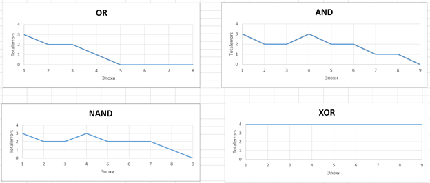

# АНАЛИЗ ДАННЫХ И ИСКУССТВЕННЫЙ ИНТЕЛЛЕКТ [in GameDev]
Отчет по лабораторной работе #4 выполнил(а):
- Леонтьев Алексей Максимович
- РИ230913

- Отметка о выполнении заданий (заполняется студентом):

| Задание | Выполнение | Баллы |
| ------ | ------ | ------ |
| Задание 1 | * | 60 |
| Задание 2 | * | 20 |
| Задание 3 | * | 20 |

Работу проверили:

## Цель работы
Ознакомится с Percetron в Unity.

## Задание 1
### В проекте Unity реализовать перцептрон, который умеет производить вычисления OR, AND, NAND и XOR. Дать комментарии по их корректности работы.
- Был скачан скрипт Perceptron и поставлена на пустой GameObject. Изменил скрипт так, чтобы можно было вводить нужное количество эпох, не залезая в сам скрипт каждый раз.
- Perceptron по данным OR учиться выполнять практически идеально после 4-5 эпох.
- Perceptron по данным AND имеет большую сложность, чем OR, поэтому 4-5 эпох недостаточно, чтобы скрипт идеально выполнял операцию AND. Достаточно 8-9 эпох для идеального выполнения операции.
- Perceptron по данным NAND по сложности AND, но более склонен к ошибкам в 6-7 эпохах, в отличии от AND. Но также идеально выполняет операцию NAND на момент 8 эпохи.
- Perceptron по данным XOR, независимо от количества эпох, всегда будет ошибаться. Как было указано в презентации, Perceptron работает по линейной функции. XOR является нелинейной, поэтому Perception никогда не сможет его корректно обработать.

## Задание 2
### Построить графики зависимости количества эпох от ошибки обучения. Указать от чего зависит необходимое количество эпох обучения.

 
- От необходимого количества эпох обучения зависит от того, сколько вводных данных было “вскормлено” Perceptron и как будет располагаться данные в линейном функции (правильного варианта). Чем больше данных и как дальше нужно делать линейную функцию для Perceptron, тем больше эпох нужно для идеального выполнения операции. Притом нужно учитывать, чтобы данные не были как XOR, иначе ничего не получится. 

## Задание 3
###  Построить визуальную модель работы Perceptron на сцене Unity.

- Поставил 2 куба с физикой друг над другом. Верхний куб – белый, а нижний – чёрный. Если Perceptron выполняет операцию идеально (то есть totalError равен 0), то когда белый соприкоснётся с чёрным, тот станет белым. Функция добавления в скрипт Perceptron. Будет передано через unitypackage.

## Выводы

Я ознакомился с Percetron и понял его принцип работы.

## Powered by

**BigDigital Team: Denisov | Fadeev | Panov**
