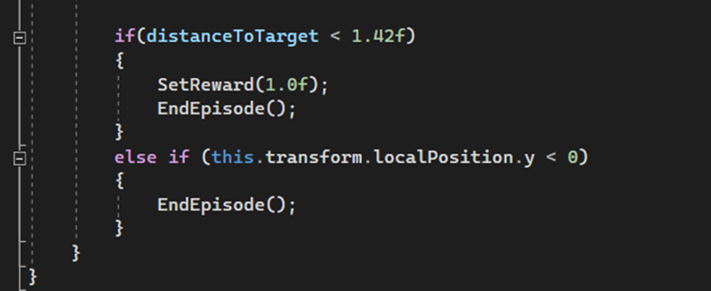
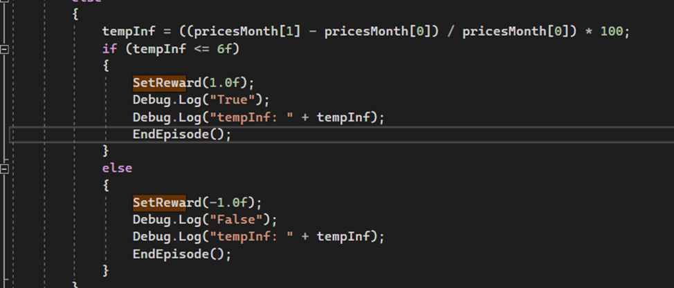

# АНАЛИЗ ДАННЫХ И ИСКУССТВЕННЫЙ ИНТЕЛЛЕКТ [in GameDev]
Отчет по лабораторной работе #5 выполнил(а):
- Леонтьев Алексей Максимович
- РИ230913

- Отметка о выполнении заданий (заполняется студентом):

| Задание | Выполнение | Баллы |
| ------ | ------ | ------ |
| Задание 1 | * | 60 |
| Задание 2 | * | 20 |
| Задание 3 | * | 20 |

Работу проверили:

## Цель работы
Познакомиться с программными средствами для создания системы машинного обучения и ее интеграции в Unity.

## Задание 1
### Найдите внутри C# скрипта “коэффициент корреляции ” и сделать выводы о том, как он влияет на обучение модели.
- Позле скачивания и ознакомления с работой ML-Agent и скриптов, приведённых в примерах, я определил, где находится “Коэффициент корреляции”.  “Коэффициент корреляции” определяется в функции OnActionReceived. В случае с RollerAgent определяется SetReward(1), если агент находится в близости с целью. Иначе “награды” нет. 

- В случае с Move, коэффициент определяется двумя способами: если было темп инфляции меньше, чем, 0.06%, то даётся SetReward(1), иначе SetReward(-1).

- Благодаря определяемым коэффициентам мы даём понять агенту, делает ли он правильно так, как мы задумали. Если правильно, то даём 1, если нет, то -1. И на основе предыдущих “опытов” последующие агенты будут стремиться совершать те действия, которые дали результат 1, по возможности избегая другие, которые дали -1.

## Задание 2
### Изменить параметры файла yaml-агента и определить какие параметры и как влияют на обучение модели. Привести описание не менее трех параметров.

- Открыв Economic.yaml, меняя значения и используя документацию по ML-Agents, основное влияние на обучение модели имеют параметры из hyperparameters и reward_signals. 
- Я изучил следующие параметры и их влияние на обучение модели:
- -	Hyperparameter – batch_size – определяет, сколько всего опытов будет проведено в каждом итерации. Их число нужно определять тем, являются ли действия сложными или простыми.
- -	 Hyperparameter – learning_rate – определяет магнитуду изменений в весах и смещений. Одна из определяемых стабильность обучения. Его стоит понижать, если обучение и получение награды модели не стабильны.
- -	Hyperparameter – beta – определяет то, насколько “рандомно” будут действия агента. Помогает с тем, чтобы агент смог определить свои возможностей. Помогает с тем, что модель будет медленно сокращать область своих действий, но при этом увеличивая количество наград.  
- -	Hyperparameter – epsilon – определяет скорость “эволюции” поведения агентов. Делает так, чтобы появлялись новые свойства, но оставляя часть старых. Малое значение даёт больше стабильности в поведении, но сокращает скорость обучения модели. 

## Задание 3
###  Приведите примеры, для каких игровых задачи и ситуаций могут использоваться примеры 1 и 2 с ML-Agent’ом. В каких случаях проще использовать ML-агент, а не писать программную реализацию решения?

- Для первого примера ML-Agent можно привести ситуацию, когда NPC ищет игрока в каком-то локации в игре. ML-Agent будет уместен в ранее заданных локациях разработчиками, где модель уже была натренирована. Если же локация генерируется рандомно, то рано или поздно модель будет безбожно тупить, сталкивая с новыми ситуациями, с которыми ещё не встречалась. А времени для тренировок. Поэтому в последнем случае лучше использовать программное решение кода, а в первом – ML-Agent.

- Для второго примера ML-Agent можно использовать в случаи, когда игра является RTS, и у игрока есть “шахтёры”, добывающие какой-то ресурс. Можно сделать динамическую систему обучения “шахтёров”, которые с течением времени становятся всё лучше и лучше. Игроку будет поощряться за сохранение юнитов для получения больших профитов, а не  использовать в виде “разведчиков” или тому подобное (привет, StarCraft 2).

- Однако система не идеальна, так как сложно обеспечить стабильный рост “уровня шахтёра”, что может повредить игровому опыту игрока. Поэтому тут на выбор, ML-Agent или программное решение.

## Выводы

Я ознакомился с программными средствами и инструментами для создания машинного обучения на основе Unity.

## Powered by

**BigDigital Team: Denisov | Fadeev | Panov**
